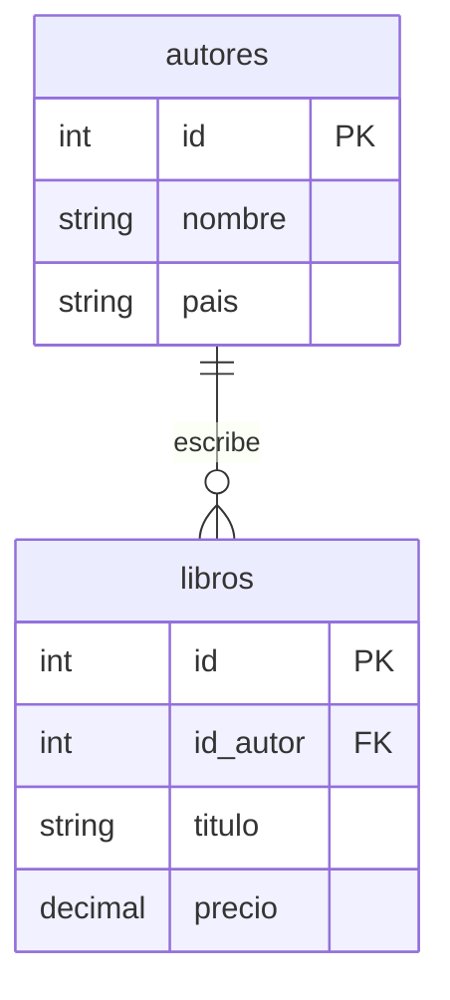

# Proyecto Final BDR – Cine con MySQL

## 1. Historia del problema

Un cine pequeño necesita controlar sus películas, salas y proyecciones. Actualmente registra las proyecciones y boletos vendidos en hojas separadas, lo que provoca errores al consultar qué película se proyecta, en qué sala y cuántos boletos se han vendido.

La organización necesita una solución sencilla en terminal que permita guardar la información de forma permanente usando una base de datos relacional.

---

## 2. Objetivo del proyecto

Crear un sistema CLI para administrar proyecciones de cine y consultar la cartelera registrada.

El sistema base será entregado por el docente funcionando con arreglos en memoria.  
El equipo deberá refactorizarlo para que funcione con **PHP-CLI + MySQL**.

---

## 3. Situación inicial

El programa ya funciona, pero guarda los datos en arreglos.

Eso significa que:

- Al cerrar el programa, los datos se pierden.
- No existe una base de datos real.
- No hay tablas, llaves primarias ni relaciones persistentes.

---

## 4. Misión del equipo

Modificar el sistema para que los datos se almacenen en MySQL.

El equipo debe conservar el flujo principal del programa y reemplazar el uso de arreglos por operaciones con base de datos.

---

## 5. Funciones mínimas del sistema

- Registrar películas
- Ver películas
- Editar películas
- Eliminar películas
- Registrar proyecciones (con cantidad de boletos disponibles)
- Vender boleto: al registrar una venta, `boletos_disponibles` disminuye y `boletos_vendidos` aumenta en la misma cantidad
- Consultar cartelera: solo muestra proyecciones con al menos 1 boleto disponible (`boletos_disponibles > 0`)

---

## 6. Consulta o reporte obligatorio

Reporte de cartelera: mostrar ID, película, sala, horario, precio, boletos vendidos y boletos disponibles.  
Solo se listan las proyecciones cuyo campo `boletos_disponibles` sea mayor a 0.

Esta consulta debe obtener información relacionada desde más de una tabla.

---

## 7. Requisitos de base de datos

El proyecto debe incluir:

- Creación de tablas con `CREATE TABLE`.
- Llaves primarias.
- Al menos una llave foránea declarada con `FOREIGN KEY` en el script SQL.
- Operaciones `INSERT`, `SELECT`, `UPDATE` y/o `DELETE` según aplique.
- Al menos una consulta con `JOIN` entre tablas.

---

## 7.1. Diagrama ER obligatorio

El equipo debe entregar un archivo `ER.mermaid` en la raíz del proyecto con el diagrama entidad-relación del modelo implementado.

Ejemplo de estructura (genérico, no relacionado con este proyecto):

El diagrama debe reflejar las tablas y relaciones **reales** del proyecto del equipo.

---

## 8. Alcance limitado

Para que el proyecto sea posible en dos semanas, **no se pide**:

- No se requiere selección de asientos
- No se requiere pago real
- No se requiere manejar promociones complejas

---

## 9. Reglas importantes

- No se debe cambiar el objetivo principal del sistema.
- No se deben usar arreglos como almacenamiento final.
- Los datos deben permanecer guardados después de cerrar y volver a abrir el programa.
- La evaluación se enfoca en la integración con MySQL, no en rediseñar toda la aplicación.

---

## 10. Entregable esperado

El equipo debe entregar:

- Código PHP-CLI funcionando.
- Script SQL con la estructura de tablas y datos iniciales (con `FOREIGN KEY` declaradas).
- Archivo `ER.mermaid` con el diagrama entidad-relación.
- Evidencia de pruebas.
- Breve explicación del modelo de datos.
